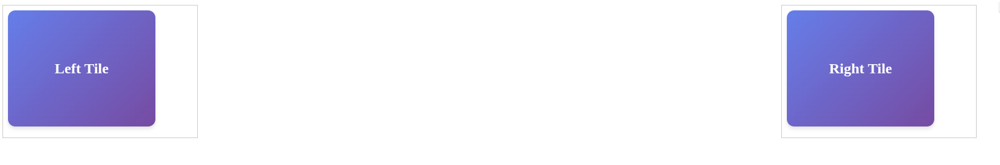

# Deploying with Kubernetes and Polyfea CRDs

In this final tutorial, you'll deploy your containerized web components to Kubernetes using Polyfea's Custom Resource Definitions (CRDs). You'll create standard Kubernetes resources (Deployment, Service) alongside Polyfea-specific resources (MicroFrontendClass, MicroFrontend, WebComponent) to bring your microfrontend to life.

## What You'll Build

- A complete Kubernetes deployment with Polyfea integration
- Custom Resource definitions for microfrontend configuration
- Context-based component loading with display rules
- A locally running microfrontend accessible through the Polyfea shell

## Prerequisites

- Completed the [Containerizing Your Web Component](docker-image.md) tutorial
- A running Kubernetes cluster (Kind, Minikube, or Docker Desktop)
- `kubectl` configured to access your cluster
- Helm 3.0+ installed
- Polyfea controller installed (instructions below)

## Step 1: Install Polyfea Controller

If you haven't already installed the Polyfea controller, install it using Helm:

```bash
helm repo add polyfea https://polyfea.github.io/charts
helm repo update
helm install polyfea-controller polyfea/polyfea-controller \
  --namespace polyfea-system \
  --create-namespace
```

Verify the installation:

```bash
kubectl get pods -n polyfea-system
```

You should see the `polyfea-controller` pod running.

## Step 2: Create the Manifests Directory

In your project root, create a directory for Kubernetes manifests:

```bash
mkdir -p manifests
cd manifests
```

All the following YAML files will be created in this directory.

## Step 3: Create the Namespace

Create `namespace.yaml`:

```yaml
apiVersion: v1
kind: Namespace
metadata:
  name: microfrontends
```

### Why a Separate Namespace?

- **Isolation**: Keeps your microfrontends separate from other workloads
- **Organization**: Easy to manage and view related resources
- **Security**: Can apply namespace-level policies and RBAC

## Step 4: Create the Deployment

Create `deployment.yaml`:

```yaml
apiVersion: apps/v1
kind: Deployment
metadata:
  name: my-webcomponent-deployment
  namespace: microfrontends
spec:
  replicas: 1
  selector:
    matchLabels:
      app: my-webcomponent
  template:
    metadata:
      labels:
        app: my-webcomponent
    spec:
      containers:
      - name: my-webcomponent-container
        image: <your-dockerhub-username>/my-web-components:latest
        ports:
        - containerPort: 80
        resources:
          limits:
            memory: "128Mi"
            cpu: "500m"
          requests:
            memory: "64Mi"
            cpu: "250m"
```

**Important**: Replace `<your-dockerhub-username>` with your actual Docker Hub username.

### Resource Configuration

- **Replicas**: Single instance is sufficient for development
- **Resource Limits**: Prevents runaway containers from consuming too many resources
- **Resource Requests**: Guarantees minimum resources for scheduling

## Step 5: Create the Service

Create `service.yaml`:

```yaml
apiVersion: v1
kind: Service
metadata:
  name: my-webcomponent-service
  namespace: microfrontends
spec:
  selector:
    app: my-webcomponent
  ports:
    - protocol: TCP
      port: 80
      targetPort: 80
  type: ClusterIP
```

### Service Type: ClusterIP

- **Internal Only**: Service is accessible only within the cluster
- **Polyfea Routing**: The controller routes external traffic through the shell application
- **Security**: No direct external exposure of individual microfrontends

## Step 6: Create the MicroFrontendClass

Create `microfrontendclass.yaml`:

```yaml
apiVersion: polyfea.github.io/v1alpha1
kind: MicroFrontendClass
metadata:
  name: my-app
spec:
  baseUri: "/myapp"
  title: "My Application"
  cspHeader: "default-src 'none'; script-src 'self' 'unsafe-inline'; style-src 'self' 'unsafe-inline'; connect-src 'self'; img-src 'self' data:; font-src 'self'; frame-src 'none'; object-src 'none'; base-uri 'self'; form-action 'self'"
```

### MicroFrontendClass Explained

- **baseUri**: The URL path where your application is accessible (e.g., `http://localhost:8080/myapp`)
- **title**: Application name shown in browser title and metadata
- **cspHeader**: Strict Content Security Policy for enhanced security
  - `default-src 'none'`: Deny everything by default
  - Only allows resources from same origin (`'self'`)
  - Prevents inline scripts and styles for maximum security

## Step 7: Create the MicroFrontend Resource

We didn't do any bundling in this tutorial, so we'll create two MicroFrontend resources for each of our web components.

Create `my-element-mf.yaml`:

```yaml
apiVersion: polyfea.github.io/v1alpha1
kind: MicroFrontend
metadata:
  name: my-element
  namespace: microfrontends
  labels:
    app.kubernetes.io/name: my-element
    app.kubernetes.io/instance: microfrontends
    app.kubernetes.io/version: "1.0"
spec:
  frontendClass: my-app
  service:
    name: my-webcomponent-service
  modulePath: my-element.js
  importMap:
    optional:
      lit: /node_modules/lit/index.js
      lit/decorators.js: /node_modules/lit/decorators.js
      lit/: /node_modules/lit/
      lit-html: /node_modules/lit-html/lit-html.js
      lit-html/: /node_modules/lit-html/
      lit-element/lit-element.js: /node_modules/lit-element/lit-element.js
      "@lit/reactive-element": /node_modules/@lit/reactive-element/reactive-element.js
      "@lit/reactive-element/": /node_modules/@lit/reactive-element/
```

Create `my-tile-element-mf.yaml`:

```yaml
apiVersion: polyfea.github.io/v1alpha1
kind: MicroFrontend
metadata:
  name: my-tile-element
  namespace: microfrontends
  labels:
    app.kubernetes.io/name: my-tile-element
    app.kubernetes.io/instance: microfrontends
    app.kubernetes.io/version: "1.0"
spec:
  frontendClass: my-app
  service:
    name: my-webcomponent-service
  modulePath: my-tile-element.js
  # optional entries are silently skipped if already registered (first-registered-wins),
  # so this can be omitted if my-element-mf.yaml is deployed first
  importMap:
    optional:
      lit: /node_modules/lit/index.js
      lit/decorators.js: /node_modules/lit/decorators.js
      lit/: /node_modules/lit/
      lit-html: /node_modules/lit-html/lit-html.js
      lit-html/: /node_modules/lit-html/
      lit-element/lit-element.js: /node_modules/lit-element/lit-element.js
      "@lit/reactive-element": /node_modules/@lit/reactive-element/reactive-element.js
      "@lit/reactive-element/": /node_modules/@lit/reactive-element/
```


### MicroFrontend Configuration

- **frontendClass**: Links to the `my-app` MicroFrontendClass
- **service**: References the Kubernetes Service that serves the web components
- **modulePath**: Path to the JavaScript module within the nginx server (relative to the service root)
- **importMap**: Defines module paths for dependencies. `optional` entries go into the global import map (first-registered-wins; duplicates are silently skipped). `scoped` entries are placed under the MF's proxy-path scope automatically.

## Step 8: Create the Shell WebComponent

Create `my-element-wc.yaml`:

```yaml
apiVersion: polyfea.github.io/v1alpha1
kind: WebComponent
metadata:
  name: my-element
  namespace: microfrontends
spec:
  microFrontend:
    name: my-element
  element: my-element
  displayRules:
    - anyOf:
      - context-name: shell
```

### Display Rules

- **context-name: shell**: This component loads in the main `shell` context
- **anyOf**: Component displays if any of the conditions match
- The `my-element` component becomes the primary container that users see first

## Step 9: Create the Tile WebComponents

Create `my-tile-element-wc.yaml`:

```yaml
apiVersion: polyfea.github.io/v1alpha1
kind: WebComponent
metadata:
  name: my-left-tile
  namespace: microfrontends
spec:
  microFrontend:
    name: my-tile-element
  element: my-tile
  attributes:
    - name: text
      value: "Left Tile"
  displayRules:
    - allOf:
      - context-name: left
---
apiVersion: polyfea.github.io/v1alpha1
kind: WebComponent
metadata:
  name: my-right-tile
  namespace: microfrontends
spec:
  microFrontend:
    name: my-tile-element
  element: my-tile
  attributes:
    - name: text
      value: "Right Tile"
  displayRules:
    - allOf:
      - context-name: right
```

### Context-Based Loading

- **Two instances** of the `my-tile` component with different configurations
- **context-name: left/right**: Matches the context areas defined in `my-element`
- **attributes**: Pass properties to the web components (e.g., the `text` property)
- **allOf**: All conditions must match for the component to display

## Step 10: Deploy to Kubernetes

Apply all manifests at once:

```bash
kubectl apply -f manifests/
```

### Troubleshooting: Namespace Not Found

If you get a namespace error, apply the namespace first:

```bash
kubectl apply -f manifests/namespace.yaml
kubectl apply -f manifests/
```

## Step 11: Verify the Deployment

Check that all resources are created:

```bash
# Check the deployment
kubectl get deployments -n microfrontends

# Check the pods
kubectl get pods -n microfrontends

# Check the service
kubectl get svc -n microfrontends

# Check Polyfea resources
kubectl get microfrontendclass
kubectl get microfrontend -n microfrontends
kubectl get webcomponent -n microfrontends
```

Wait for the pod to be in `Running` state:

```bash
kubectl wait --for=condition=ready pod -l app=my-webcomponent -n microfrontends --timeout=60s
```

## Step 12: Access Your Application

Port-forward the Polyfea controller service to access the application locally:

```bash
kubectl port-forward -n polyfea-system svc/polyfea-controller 8080:80
```

Keep this terminal open while accessing the application.

Open your browser and navigate to:

```
http://localhost:8080/myapp
```

You should see:

- The `my-element` grid container in the shell context
- The "Left Tile" component in the left grid cell
- The "Right Tile" component in the right grid cell



## Understanding the Complete Flow

1. **Browser Request**: User navigates to `/myapp`
2. **Polyfea Shell**: Controller serves the shell application
3. **Shell Context**: Shell loads `my-element` component in the shell context
4. **Context Discovery**: `my-element` renders with `<polyfea-context name="left">` and `<polyfea-context name="right">`
5. **Component Loading**: Polyfea runtime fetches and loads the appropriate `my-tile` components into each context

## What's Next?

Congratulations! You've successfully:

- Created Kubernetes Deployment and Service manifests
- Defined Polyfea Custom Resources (MicroFrontendClass, MicroFrontend, WebComponent)
- Deployed a microfrontend to a local Kubernetes cluster
- Used context-based component loading with display rules
- Tested the complete Polyfea integration